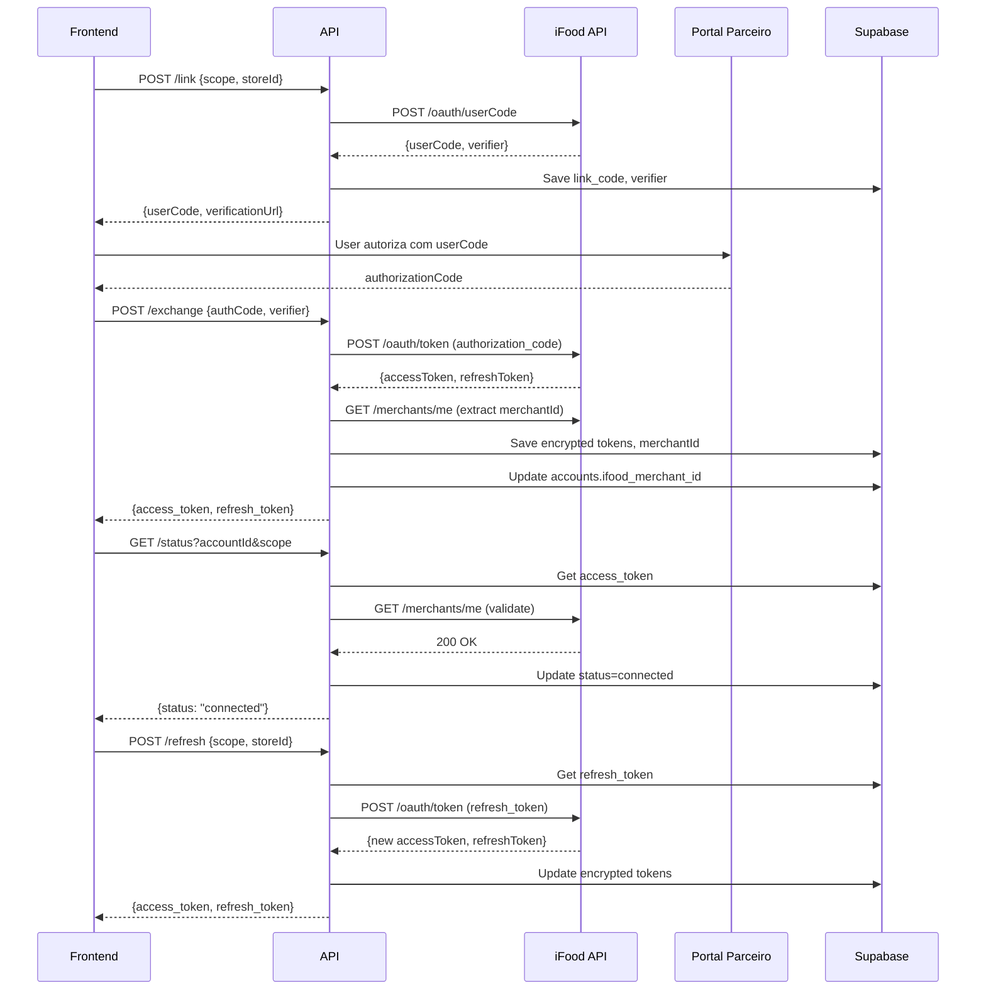

# 🔐 iFood Authentication API

API de autenticação distribuída do iFood seguindo o padrão OAuth 2.0.

## 📚 Documentação Oficial

- [Guia de Autenticação](https://developer.ifood.com.br/pt-BR/docs/guides/authentication)
- [Fluxo Distribuído](https://developer.ifood.com.br/pt-BR/docs/guides/authentication/distributed)
- [Merchant Workflow](https://developer.ifood.com.br/pt-BR/docs/guides/merchant/workflow)

## 🎯 Endpoints

### 1. POST `/api/ifood-auth/link`
Solicita código de vínculo (`userCode`) para iniciar o fluxo OAuth distribuído.

**Request (nosso backend):**
```json
{
  "scope": "reviews" | "financial",
  "accountId": "<UUID da tabela accounts.id>",
  "merchantId": "<opcional: merchantId iFood>"
}
```

> **Importante:**
> - Diferente dos exemplos genéricos da doc oficial, aqui o identificador principal é o `accountId` (UUID interno da tabela `accounts`).
> - O `merchantId` ainda não é obrigatório nesta etapa; ele será resolvido/atualizado após o `exchange`.

**Response:**
```json
{
  "userCode": "ABC123",
  "authorizationCodeVerifier": "verifier_xyz...",
  "verificationUrl": "https://portal.ifood.com.br/...",
  "expiresIn": 600
}
```

**Processo (implementação atual):**
1. Valida `accountId` como UUID e `scope` (`reviews`/`financial`).
2. Seleciona o `clientId` correto por escopo:
   - `IFOOD_CLIENT_ID_REVIEWS` para `reviews`.
   - `IFOOD_CLIENT_ID_FINANCIAL` para `financial`.
3. Chama a API iFood `/authentication/v1.0/oauth/userCode` **sempre com o parâmetro `clientId` (camelCase)** no corpo `x-www-form-urlencoded`.
4. A chamada é feita preferencialmente através do **proxydex** (quando configurado):
   - `IFOOD_PROXY_BASE?path=/authentication/v1.0/oauth/userCode` + header `X-Shared-Key: IFOOD_PROXY_KEY`.
   - Se o proxydex não estiver configurado, cai na URL direta do iFood.
5. Salva `link_code` (`userCode`) e `verifier` (`authorizationCodeVerifier`) em `ifood_store_auth` com `status = 'pending'` (
   `account_id = accountId`, `scope`).
6. Retorna os dados para o frontend exibir o `userCode` e a `verificationUrl` para o lojista.

---

### 2. POST `/api/ifood-auth/exchange`
Troca o `authorizationCode` (fornecido pelo lojista no Portal) por `access_token` e `refresh_token`.

**Request (nosso backend):**
```json
{
  "scope": "reviews" | "financial",
  "storeId": "<UUID accounts.id OU merchantId>",
  "merchantId": "<opcional: merchantId iFood>",
  "authorizationCode": "<código recebido no Portal>",
  "authorizationCodeVerifier": "<verifier salvo na etapa /link>"
}
```

**Response:**
```json
{
  "access_token": "eyJ...",
  "refresh_token": "eyJ...",
  "expires_in": 3600
}
```

**Processo (implementação atual):**
1. Resolve o `account_id` interno a partir de `storeId` e/ou `merchantId`:
   - Tenta `accounts.id = storeId`.
   - Se não encontrar, tenta `accounts.ifood_merchant_id = merchantId` ou `storeId`.
2. Seleciona o `clientId` correto por escopo (`IFOOD_CLIENT_ID_REVIEWS` / `IFOOD_CLIENT_ID_FINANCIAL`).
3. Chama a API iFood `/authentication/v1.0/oauth/token` com grant equivalente a **authorization code + PKCE** usando corpo `x-www-form-urlencoded`:
   - `grantType` (doc oficial) → enviamos `grant_type = 'authorization_code_pkce'`.
   - `clientId` → usamos **sempre `clientId` (camelCase)** no corpo.
   - `authorizationCode` → enviamos como `code`.
   - `authorizationCodeVerifier` → enviamos como `code_verifier`.
   - `redirect_uri` e `scope` são incluídos conforme configurado.
   - A chamada é feita preferencialmente via proxydex: `IFOOD_PROXY_BASE?path=/authentication/v1.0/oauth/token` + `X-Shared-Key`.
4. Normaliza a resposta do iFood, aceitando tanto `accessToken`/`refreshToken` quanto `access_token`/`refresh_token`.
5. Resolve o `merchantId` usando múltiplos fallbacks: campo direto da resposta, endpoint `/merchant/v1.0/merchants/me` e claims JWT.
6. Criptografa `accessToken` e `refreshToken` com AES-GCM (`encryptToB64`) e faz `upsert` em `ifood_store_auth` com `status = 'connected'`.
7. Atualiza `accounts.ifood_merchant_id` com o `merchantId` final.

---

### 3. POST `/api/ifood-auth/refresh`
Renova o `access_token` usando o `refresh_token` previamente salvo.

**Request (nosso backend):**
```json
{
  "scope": "reviews" | "financial",
  "storeId": "<ifood_merchant_id OU accounts.id>"
}
```

**Response:**
```json
{
  "access_token": "eyJ...",
  "refresh_token": "eyJ...",
  "expires_in": 3600
}
```

**Processo (implementação atual):**
1. Resolve o `account_id` interno a partir de `storeId`:
   - Primeiro tenta `accounts.ifood_merchant_id = storeId`.
   - Fallback: `accounts.id = storeId`.
2. Busca em `ifood_store_auth` o registro para esse `account_id` e `scope` (com fallback para o escopo oposto se não encontrar).
3. Se o `access_token` atual ainda for válido por mais de 120s, descriptografa e retorna **sem** chamar a API iFood (otimização anti rate-limit).
4. Caso precise renovar, descriptografa o `refresh_token` (`decryptFromB64`).
5. Seleciona o `clientId` correto por escopo e chama `/authentication/v1.0/oauth/token` via proxydex com corpo `x-www-form-urlencoded`:
   - Doc oficial: `grantType = refresh_token`, `clientId`, `clientSecret`, `refreshToken`.
   - Implementação atual: enviamos `grant_type = 'refresh_token'`, `clientId` (camelCase) e `refresh_token` (snake_case) + `scope`.
6. Criptografa os novos tokens (`encryptToB64`) e atualiza `ifood_store_auth` (tokens + `expires_at`, `status = 'connected'`).
7. Retorna `access_token`, `refresh_token` e `expires_in` em camelCase para o frontend.

---

### 4. GET `/api/ifood-auth/status`
Valida o status da autenticação chamando a API real do iFood.

**Request (nosso backend):**
```http
GET /api/ifood-auth/status?accountId=<UUID accounts.id>&scope=reviews|financial
```

**Response:**
```json
{
  "status": "connected",
  "message": "Token validated successfully with iFood API",
  "merchantId": "merchant-id"
}
```

**Status Possíveis:**
- `connected`: Token válido
- `pending`: Não autenticado ou token expirado
- `error`: Erro de validação

**Processo (implementação atual):**
1. Busca `access_token` criptografado em `ifood_store_auth` por `account_id` + `scope`.
2. Descriptografa o token (`decryptFromB64`).
3. Chama diretamente `GET /merchant/v1.0/merchants/me` na API iFood com `Authorization: Bearer <access_token>`.
4. Se a resposta for 200, considera o vínculo **conectado** e atualiza `ifood_store_auth.status = 'connected'` e `ifood_merchant_id` (quando disponível).
5. Se a resposta for 401/403, considera o status **pending** (token expirado/revogado, mas sem alterar o registro salvo).
6. Outros erros retornam `status = 'error'` com detalhes.

---

## 🔧 Variáveis de Ambiente

### Obrigatórias

```env
# Supabase
SUPABASE_URL=https://seibcrrxlyxfqudrrage.supabase.co
SUPABASE_SERVICE_ROLE_KEY=eyJ...

# iFood (opção 1: credenciais únicas)
IFOOD_CLIENT_ID=seu-client-id
IFOOD_CLIENT_SECRET=seu-client-secret

# Criptografia (32 bytes em base64)
ENCRYPTION_KEY=base64-encoded-key
```

### Opcionais

```env
# iFood (opção 2: credenciais por escopo)
IFOOD_CLIENT_ID_REVIEWS=client-id-reviews
IFOOD_CLIENT_SECRET_REVIEWS=client-secret-reviews
IFOOD_CLIENT_ID_FINANCIAL=client-id-financial
IFOOD_CLIENT_SECRET_FINANCIAL=client-secret-financial

# Configurações
IFOOD_BASE_URL=https://merchant-api.ifood.com.br
CORS_ORIGIN=https://seu-frontend.vercel.app
```

### Gerar ENCRYPTION_KEY

```bash
# Node.js
node -e "console.log(require('crypto').randomBytes(32).toString('base64'))"

# OpenSSL
openssl rand -base64 32
```

---

## 🗄️ Schema Supabase

```sql
create table public.ifood_store_auth (
  id uuid not null default gen_random_uuid(),
  account_id text not null,
  ifood_merchant_id text null,
  link_code text null,
  verifier text null,
  access_token text null,
  refresh_token text null,
  expires_at timestamp with time zone null,
  status text not null default 'pending',
  created_at timestamp with time zone not null default now(),
  updated_at timestamp with time zone not null default now(),
  scope text not null,
  
  constraint ifood_store_auth_pkey primary key (id),
  constraint ifood_store_auth_account_id_scope_uix unique (account_id, scope),
  constraint ifood_store_auth_scope_chk check (scope = any (array['reviews', 'financial'])),
  constraint ifood_store_auth_status_chk check (status = any (array['pending', 'connected', 'error']))
);

create index ifood_store_auth_merchant_idx on public.ifood_store_auth (ifood_merchant_id);
create index idx_ifood_store_auth_store on public.ifood_store_auth (account_id);
create trigger trg_ifood_store_auth_updated before update on ifood_store_auth 
  for each row execute function set_updated_at();
```

---

## 🔄 Fluxo Completo



---

## 🧪 Testes

### Script Bash Interativo
```bash
./test-ifood-auth.sh https://seu-backend.railway.app uuid-da-conta reviews
```

### Queries SQL
Execute as queries em `test-ifood-auth.sql` no Supabase SQL Editor.

### Teste Manual com cURL

#### 1. Link
```bash
curl -X POST https://seu-backend/api/ifood-auth/link \
  -H "Content-Type: application/json" \
  -d '{"scope":"reviews","storeId":"uuid"}'
```

#### 2. Exchange
```bash
curl -X POST https://seu-backend/api/ifood-auth/exchange \
  -H "Content-Type: application/json" \
  -d '{
    "scope":"reviews",
    "storeId":"uuid",
    "authorizationCode":"ABC123",
    "authorizationCodeVerifier":"verifier"
  }'
```

#### 3. Status
```bash
curl "https://seu-backend/api/ifood-auth/status?accountId=uuid&scope=reviews"
```

#### 4. Refresh
```bash
curl -X POST https://seu-backend/api/ifood-auth/refresh \
  -H "Content-Type: application/json" \
  -d '{"scope":"reviews","storeId":"merchant-id"}'
```

---

## 🔒 Segurança

### Criptografia
- **Algoritmo:** AES-GCM (256 bits)
- **IV:** 12 bytes aleatórios por token
- **Formato:** Base64(IV + ciphertext)

### Boas Práticas
- ✅ Tokens nunca armazenados em plaintext
- ✅ Service role key nunca exposta no frontend
- ✅ CORS configurado para domínios específicos
- ✅ Validação de entrada em todos os endpoints
- ✅ Logs não expõem tokens sensíveis

### Checklist de Segurança
- [ ] ENCRYPTION_KEY gerada aleatoriamente
- [ ] ENCRYPTION_KEY diferente em prod/dev
- [ ] SUPABASE_SERVICE_ROLE_KEY protegida
- [ ] CORS_ORIGIN configurado corretamente
- [ ] HTTPS obrigatório em produção
- [ ] Rate limiting implementado (recomendado)

---

## 🐛 Troubleshooting

### Erro: "Missing ENCRYPTION_KEY"
**Causa:** Variável de ambiente não configurada.
**Solução:** Gere e configure ENCRYPTION_KEY.

### Erro: "Decryption failed"
**Causa:** ENCRYPTION_KEY mudou ou token corrompido.
**Solução:** Re-autentique a conta (novo fluxo link→exchange).

### Erro: "Conta não encontrada"
**Causa:** storeId inválido ou conta não existe.
**Solução:** Verifique UUID na tabela accounts.

### Erro: "Token expired or revoked"
**Causa:** Token expirado ou revogado pelo iFood.
**Solução:** Use /refresh ou re-autentique.

### Erro: "iFood API returned 401"
**Causa:** Credenciais inválidas ou token expirado.
**Solução:** Verifique CLIENT_ID/SECRET ou use refresh.

### Status sempre "pending"
**Causa:** Exchange não foi executado ou falhou.
**Solução:** Verifique logs do exchange e tente novamente.

---

## 📊 Monitoramento

### Queries Úteis

**Contas conectadas:**
```sql
SELECT COUNT(*) FROM ifood_store_auth 
WHERE status = 'connected' AND expires_at > NOW();
```

**Tokens expirando em breve:**
```sql
SELECT account_id, scope, expires_at 
FROM ifood_store_auth
WHERE expires_at < NOW() + INTERVAL '10 minutes'
  AND expires_at > NOW();
```

**Taxa de sucesso por escopo:**
```sql
SELECT 
  scope,
  COUNT(*) as total,
  COUNT(*) FILTER (WHERE status = 'connected') as conectadas,
  ROUND(100.0 * COUNT(*) FILTER (WHERE status = 'connected') / COUNT(*), 2) as taxa_sucesso
FROM ifood_store_auth
GROUP BY scope;
```

---

## 🚀 Deploy

### Vercel
1. Configure variáveis de ambiente no dashboard
2. Deploy automático via GitHub
3. Rotas serverless criadas automaticamente

### Railway
1. Configure variáveis de ambiente
2. Deploy via GitHub ou CLI
3. Endpoints disponíveis em `https://seu-app.railway.app`

### Validação Pós-Deploy
```bash
# Health check
curl https://seu-backend/

# Teste link (não requer autenticação prévia)
curl -X POST https://seu-backend/api/ifood-auth/link \
  -H "Content-Type: application/json" \
  -d '{"scope":"reviews","storeId":"uuid-valido"}'
```

---

## 📝 Changelog

### v1.0.0 (2025-01-03)
- ✅ Implementação completa do fluxo distribuído
- ✅ Suporte a múltiplos escopos (reviews, financial)
- ✅ Criptografia AES-GCM para tokens
- ✅ Validação real via API iFood
- ✅ Otimização de refresh (reutiliza tokens válidos)
- ✅ Extração robusta de merchantId (3 fallbacks)
- ✅ Documentação completa

---

## 🤝 Contribuindo

1. Siga o padrão de código existente
2. Adicione testes para novos recursos
3. Atualize a documentação
4. Não commite credenciais ou tokens

---

## 📞 Suporte

- **Documentação iFood:** https://developer.ifood.com.br/support
- **Equipe Dex:** suporte@usa-dex.com.br

---

**Última atualização:** 2025-01-03  
**Versão:** 1.0.0
